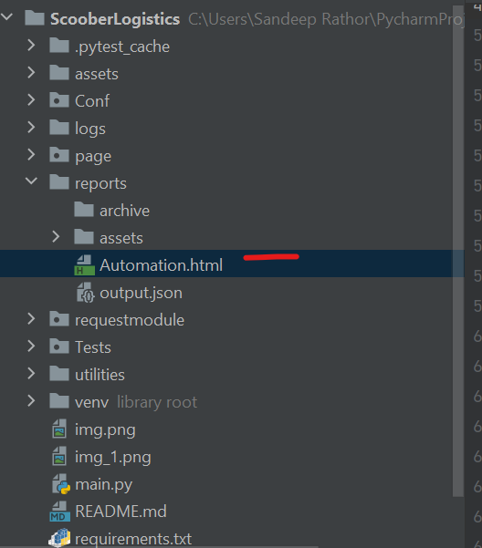
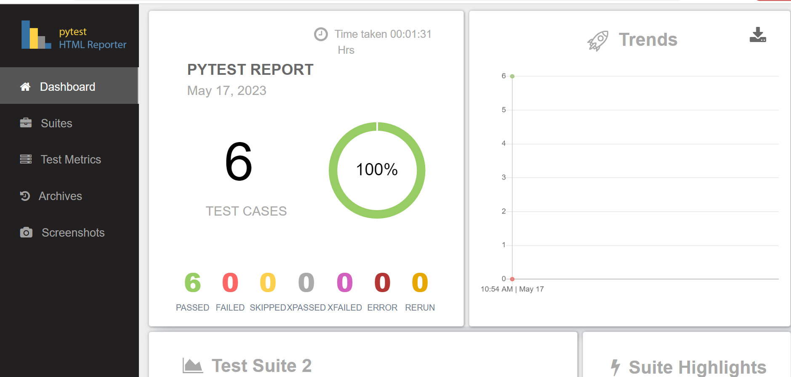

# Scoober Logistics Automation Framework(SLAF) #

A Pytest framework built using python to perform  WEB and API automation.

**Libraries used:**
1. Pytest
2. Faker
3. Selenium
4. requests
5. pytest-html-reporter
6. webdriver_manager

**Build Tool:** PyTest

### Getting Started ###

### Prerequisites

What you need to install before importing the project.
    Create virtual environment using
``
pip install --user virtualenv
``
and then import the project from the repository. 
After import create the virtual env in the terminal for your favourite IDE, then activate the virtual env and install all the given requirements.
```pythonverboseregexp
python -m virtualenv venv
 
source venv/bin/activate
    
pip3 install -r requirements.txt 
```

### Running the app
To run the app like:
1. If user wants to run all the test including both API and UI then he must type the command in the terminal like
 ```buildoutcfg
pytest .\Tests\
```
2. If user wants to run the API tests only then he must type the command:
```buildoutcfg
pytest Tests\api_test\test_api.py 
```
3. If user wants to run the UI test only then he must type the command:
```buildoutcfg
pytest Tests\ui_test\test_web.py
```
### Reporting
In this framework Pytest-html-report report is being used. In order to check and run the html reports run the following command in the project terminal.
```buildoutcfg
 pytest Tests\ --html-report=./reports/Automation.html
```
Run the command according to feature file as you did earlier for api type in the last `pytest Tests\api_test\test_api.py -v --html=./reports/Automation.html` Above command will execute all the test cases.

All the data of the report will be stored in the `/report` folder like below:


And report should be displayed like this


### References
* Python Faker: https://faker.readthedocs.io/en/master/
* pytest-html-reporter: https://pypi.org/project/pytest-html-reporter/
* Web-driver-manager: https://pypi.org/project/webdriver-manager/
